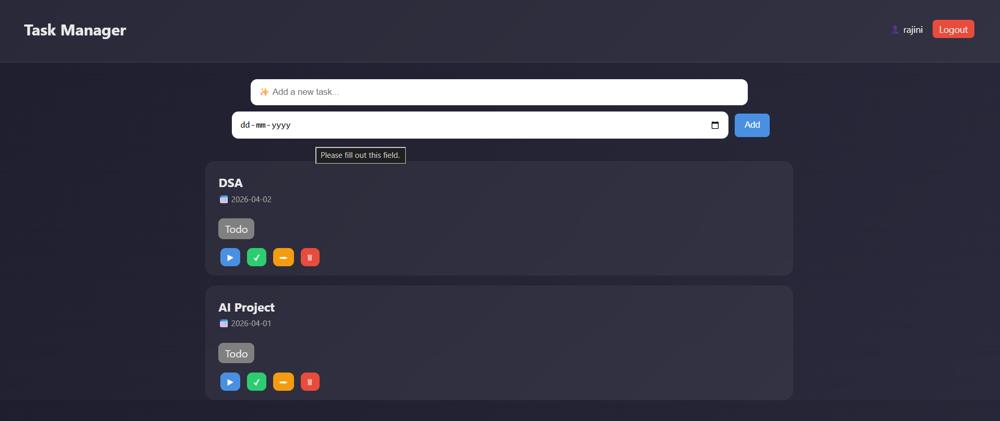
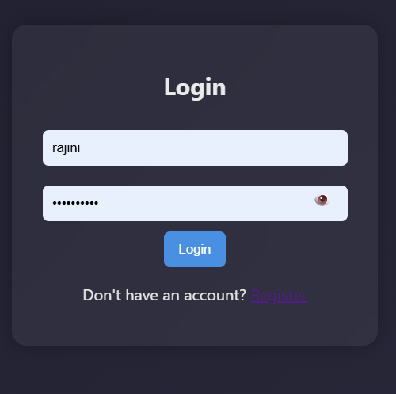

Task Manager App

A full-stack Task Manager web application built using Flask that helps users manage tasks efficiently.

 Features
- 🔐 User Authentication
- ➕ Add, Edit, Delete Tasks
- 📌 Task Status Tracking
- 📅 Due Dates
- 👤 User Dashboard

 🛠 Tech Stack
- Python (Flask)
- SQLite
- HTML, CSS

 ▶️ Run Locally
pip install flask flask_sqlalchemy werkzeug  
python app.py

 📸 Screenshots

